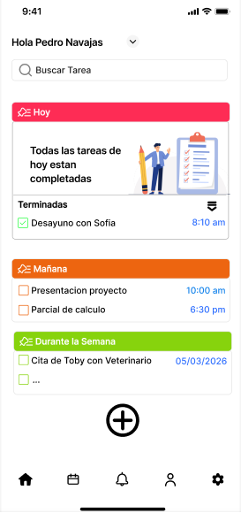

# Diseño de interfaz de usuario

La aplicación tendrá la siguientes pantallas, Una de Inicio; Crear tarea y un Calendario. La interfaz de usuario de la aplicación Metodo Cosecha toma de referencias en la interfaz de usuario de aplicaicones similares

1. Pantalla 1: INICIO

# Referencias

- [Material Design: Foundations](https://m3.material.io/foundations)
- [Material Design: Style](https://m3.material.io/styles)
