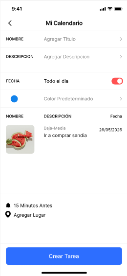

# Diseño de interfaz de usuario

La aplicación tendrá la siguientes pantallas, Una de Inicio; Crear tarea y un Calendario. La interfaz de usuario de la aplicación Metodo Cosecha toma de referencias en la interfaz de usuario de aplicaicones similares

1. Pantalla 1: INICIO
   Cuando el usuario ingrese a la aplicacion se encontrara con este organizador de tarea en listas con sus colores reconocibles

2. Pantalla 2: CREAR TAREA
   Pasando por una de las funciones de la app que esta intuitivamente con un boton de "+", sigue el de crear una tarea o pendiente con          varios aspectos para que se pueda separar de otras tareas

# Referencias

- [Material Design: Foundations](https://m3.material.io/foundations)
- [Material Design: Style](https://m3.material.io/styles)
